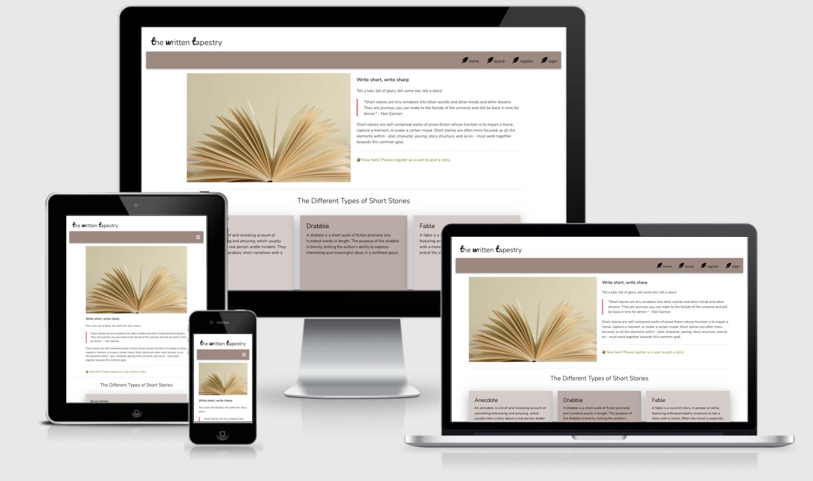

#### CODE INSTITUTE - Milestone Three Project
# The Written Tapestry

This project features a website for short-story writing. User registration of an account is required for stories to be posted. 

View this project here: &nbsp; &nbsp; [The Written Tapestry](https://the-written-tapestry.herokuapp.com/)

#UX 

# User Story

## Vistor to the website 
* I want to know what this website is about at first glance.
* I like to write short stories and want a place to showcase my writing.
* I want the colors to be soft and easy to the eyes as I could stay on this website for a stretch of time.
* I want to be able to delete or edit my writing when or if I want to.
* I want to search for stories that have been posted.
* I do not want any other writers to delete or edit my writing. 

### These goals are accomplished via:
* The story board features all writings posted onto the website by all the authors.
* The stories are searchable through author, category names and keywords.
* In logged in view, story board post will have the option of edit and delete for post of the user that is logged in. 
* Author's profile page is only accessible by user when logged in and features a list of all the stories posted by only this author which they are then able to edit and/or delete.

# 1. Strategy
* The target users to this website are people who like to write, or read short stories. 
* The website should be visually balanced in layout and colors. Content should be spread out so information can be easily extracted in a glance. Color should be soft and suitable for viewing over a long period of time.
* Easy to register as a user. 
* The website should be easy to use with straightforward log in and log out function. 
* Search function covers keywords, author and category names.
* Only the owner of a post and administration have the ability to delete or edit said post.
* Provide some information about the different types of short stories.

# 2. Scope 
* Landing page features short description of types of short stories.
* Intent of the website is made clear from the first sentence.
* Registration is easy with just inputs of username, first & last names and a short bio. 
* Edit and deletion of post by owner of post via profile page and also on story board page.
* Administration can delete users and post.

# 3. Structure
* Consistant feature across all pages are:
    * logo at the top
    * navigation bar
    * copyright at footer
    * when logged in, message below navbar to show that user is logged in. 

* Forms:
    * single center aligned 
    * edit, submit, cancel, delete buttons at the bottom of the form

* Stories:
    * each story post is contained in a box with labels title, author, date, category name and composition.
    * all story post will be featured on the board. 
    * search box for easy finding of stories sit at the top of the main content. 

* Profile:
    * Viewable only when logged in as user or administration.
    * Standard(unchangeable) useravatar with username.
    * List of stories written by the user.

* Users:   
    * Viewable only when logged in as administration.
    * Box list of users with button to delete user.

# 4. Skeleton 
* Wireframes:

# 5. Surface

## Colors:
* Background for all pages is *white*

* Button colors:
    
# 

## Commits 

## Credits 

### Content
* awaitingthemuse.wordpress.com
* wikipedia

useravatar png 
https://www.pngaaa.com/

### Testing

w

