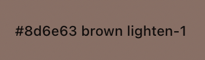
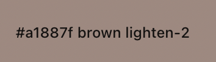
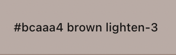
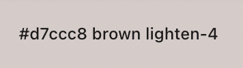
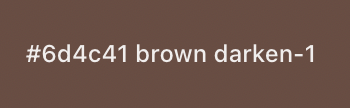
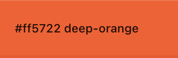
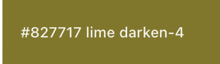
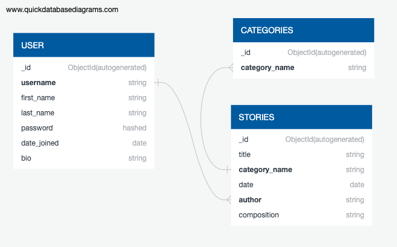

#### CODE INSTITUTE - Milestone Three Project
# The Written Tapestry

This project features a website for short-story writing. User registration of an account is required for stories to be posted. 

View this project here: &nbsp; &nbsp; [The Written Tapestry](https://the-written-tapestry.herokuapp.com/)

Repository can be found here : [The Written Tapestry](https://github.com/finnsterfran/The_Written_Tapestry)

# User Story

## Visitor to the website 
* I want to know what this website is about at first glance.
* I like to write short stories and want a place to showcase my writing.
* I want the colors to be soft and easy to the eyes as I could stay on this website for a stretch of time.
* I want to be able to delete or edit my writing when or if I want to.
* I want to search for stories that have been posted.
* I do not want any other writers to delete or edit my writing. 

### These goals are accomplished via:
* The story board features all writings posted onto the website by all the authors.
* The stories are searchable through author, category names and keywords.
* In logged in view, story board post will have the option of edit and delete for post of the user that is logged in. 
* Author's profile page is only accessible by user when logged in and features a list of all the stories posted by only this author which they are then able to edit and/or delete.

 

# 1. Strategy
* The target users to this website are people who like to write, or read short stories. 
* The website should be visually balanced in layout and colors. Content should be spread out so information can be easily extracted in a glance. Color should be soft and suitable for viewing over a long period of time.
* Easy to register as a user. 
* The website should be easy to use with straightforward log in and log out function. 
* Search function covers keywords, author and category names.
* Only the owner of a post and administration have the ability to delete or edit said post.
* Provide some information about the different types of short stories.

 

# 2. Scope 
* Landing page features short description of types of short stories.
* Intent of the website is made clear from the first sentence.
* Registration is easy with just inputs of username, first & last names and a short bio. 
* Edit and deletion of post by owner of post via profile page and also on story board page.
* Administration can delete users and post.

 

# 3. Structure
* Consistant feature across all pages are:
    * logo at the top
    * navigation bar
    * copyright at footer
    * when logged in, message below navbar to show that user is logged in. 

* Forms:
    * single center aligned 
    * edit, submit, cancel, delete buttons at the bottom of the form

* Stories:
    * each story post is contained in a box with labels title, author, date, category name and composition.
    * all story post will be featured on the board. 
    * search box for easy finding of stories sit at the top of the main content. 

* Profile:
    * Viewable only when logged in as user or administration.
    * Standard(unchangeable) useravatar with username.
    * List of stories written by the user.

* Users:   
    * Viewable only when logged in as administration.
    * Box list of users with button to delete user.

 

# 4. Skeleton 
## Click [Wireframes](WIREFRAME.md) to view the wireframes. 

 

# 5. Surface

## Colors:
* Background for all pages is *white* 
* Fonts mostly *black* 

* Color scheme: Selected from materializecss color chart

 

## Typography:
* From Google Fonts - 
    * Pacifico 
    * Nunito - 200, 300, 400, 600

 

## Icons/Images:
* All icons are from [Font Awesome](https://fontawesome.com/)
* Home page image is from [Unsplash](https://unsplash.com/)
* Useravatar png is from [PngAAA](https://www.pngaaa.com/)

 

## Information Architecture 
* This project uses MongoDB Atlas, a cloud NoSQL database.

### This database contains 3 collections of data:
    * category
    * stories
    * users

1. category lends itself as the field 'category_name' in the stories collection.
    * when user creates a story, they select a category_name out of the category collection
2. users lends itself as a field titled 'author' in stories
    * user has to log in when creating a story
    * when user creates a story, session user is automatically recorded as the author when creating a new story

 

# Features 
## Navigation bar
* The links on the navigation bars changes depending if user is logged in or user is administration.
* Standard homepage navigation links are:
    * home
    * board - display of stories that have been posted by users
    * register - form to register as a new user
    * login - for registered users to log in

* When user is logged in, the navigation bar will display:
    * home
    * board
    * add a Story
    * profile - user profile page that shows all the post of logged in user
    * log out

* When user is Administration, the navigation bar will display:
    * home
    * board
    * add a Story
    * profile 
    * user 
    * log out

## Homepage 
* Brief introduction to the website and its purpose. With enclosed link to registration page, this features does not appear when user is already logged in.
* Brief information about the different types of short stories. 

## Board 
* Search feature to find story through keywords, author, title and category. 
* All stories from users, listed alphabetically by title.
    * When user is logged in, user can only edit or delete their own stories.
    * When administration is logged in, administration can edit and delete any of the stories.

## Registration 
* Form for new users to register an account, requiring these inputs: 
    * username
    * first name
    * last name
    * password
    * confirm password

## Login 
* Form to log registered users in, requiring input of username and password.

## Log out 
* Button to exit logged in state will appear when user is logged in.

## Add a Story 
* Form to create and post a new story, user log in is required for this page to be available. 
* Inputs required: 
    * title
    * category, selected from a dropdown list of choices
    * composition
        
## Edit a Story 
* This page is accessible via board and profile pages.

## Features Left to Implement
* A link to each story type on the homepage that will bring user to a page with all stories in that category.
* User option to change avatar pictures, preferably from a predetermined set of avatar images so as to keep the profile page visually uniformed.
* Add more profile details with possibility for users to change these details.
* A community message board for users to communicate with each other.
* Possibilty of changing password should the user forget it. This will require registration of a primary email when making a new account, or updating this input in existing accounts.

 

# Technoglogies Used
## Languages:
* [HTML5](https://en.wikipedia.org/wiki/HTML) 
* [CSS3](https://en.wikipedia.org/wiki/CSS) 
* [JavaScript](https://en.wikipedia.org/wiki/JavaScript)
* [Python3](https://en.wikipedia.org/wiki/Python_(programming_language))
* [Jinja2](https://jinja.palletsprojects.com/en/3.0.x/) 

## Frameworks:
* [Flask](https://flask.palletsprojects.com/en/2.0.x/) 
* [MaterializeCSS](https://materializecss.com/) 
    * [jQuery](https://jquery.com/) 

## Vital Tools: 
* Database:
    * [MongoDB Atlas](https://www.mongodb.com/)
        * [PyMongo](https://pymongo.readthedocs.io/en/stable/) 
* Deployment platform:
    * [Heroku](https://heroku.com/)
* Workspace and Version Control: 
    * [GitHub](https://github.com/)
    * [Git](https://git-scm.com/)
    * [Gitpod](https://gitpod.io)
* Others:
    * [Quick DBD](https://app.quickdatabasediagrams.com) - To design dataschema
    * [RandomKeygen](https://randomkeygen.com/) - To generate a secret key
    * [Am I Responsive?](http://ami.responsivedesign.is/) - To check appearance of responsiveness across all devices

 

# Testing
## Click [Testing](testing.md) to read the testing process.

 

# Deployment 
## Click [Deployment](deployment.md) to read the deployment process.

 

# Credits 
## Code
* Code institute tutorial by Tim Nelson

## Content
* Web Content 
    * [Masterclass](https://www.masterclass.com/articles/how-to-write-a-great-short-story-writing-tips-and-exercises-for-story-ideas)
    * [Awaiting the Muse](https://awaitingthemuse.wordpress.com/)
    * [Wikipedia](https://www.wikipedia.org/)

## Acknowledgement 
* My mentor Excellence Illesanmi for his guidance from project start to finish line.
* Tutors (Kevin, Igor) from Code Institute who pointed me in the right direction so I could figure out for myself what I was doing wrong in my codes.
* Slack community peer-review for pointing out bugs for me to fix. 

End of Page