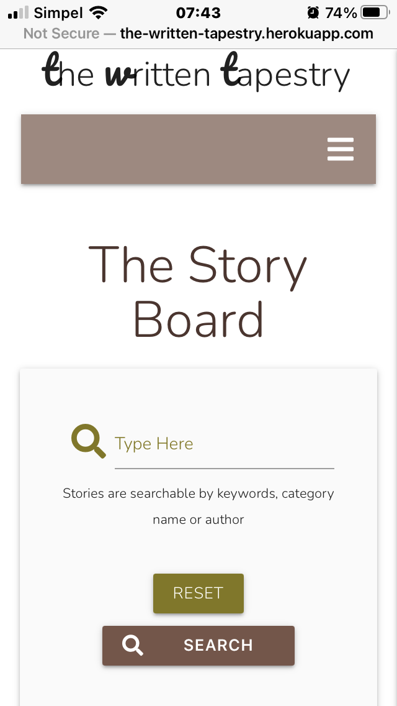

# Testing Process
# HTML - Codes were put through [W3Validator](https://validator.w3.org/)
### To avoid error from jinja templating, these steps were taken: 
    * open Chrome browser to webpage for testing
    * open developer tools
    * open network
    * select DOC
    * choose document from Name
    * select Response
    * copy code and paste into W3Validator
    * run code for checking

* home.html - Document checking completed with no errors.
* get_stories.html - Document checking completed with no errors.
* register.html - Document checking completed with no errors.
* login.html - Document checking completed with no errors.
* profile.html - Document checking completed with no errors.
* new_story.html - Document checking completed with no errors.
* user.html - Document checking completed with no errors.

 

# CSS - Codes were put through [W3C CSS-Validator](https://jigsaw.w3.org/css-validator/)
* style.css - Document checking completed with no errors.

 

# JSHINT - Codes were put through [JSHint](https://jshint.com/)
* script.js - Threw 2 warnings in discovery of ES6 syntax codes (e.g 'let')

 

# PEP8 online - Codes were put through [PEP8 Online](http://pep8online.com/)
* app.py - All right. 

 

# Testing User Story
1. I want to know what this website is about at first glance.
    * Summary on homepage informs on what the site is about.
    * Short information of the types of short stories provides.
    * Link prompt telling new users to register to be able to start posting stories.

2. I like to write short stories and want a place to showcase my writing.
    * New users can post stories to the board.

3. I want the colors to be soft and easy to the eyes as I could stay on this website for a stretch of time.
    * Colors are kept to soft brown. 
    * Feedback from peer-review is positive for color choice.

4. I want to be able to delete or edit my writing when or if I want to.
    * User can delete and edit their own stories via profile page or on board page.

5. I want to search for stories that have been posted.
    * Search function is available on the board page. Stories are searchable by keywords, author's name, category and title of story.

6. I do not want any other writers to delete or edit my writing. 
    * Access to deletion and editing function of stories is confined to owner of story and administration.

 

# Testing Functionality 
1. Login 
    * To log in to account, input password username and password. 
    * If incorrect password or usernamne is entered, error message flashes.

2. Logout 
    * Log out button in navbar appears upon user log in.
    * Logging out flashes messages "You have been logged out", user redirected to log in page.

3. Register
    * Register form works as it should. 
    * New user redirected to profile page. Flash message shows successful registration.

4. Add a Story
    * User log in required or this function does not show.
    * Story successfully added.

5. Edit Story 
    * User log in required or this function does not show.
    * Story successfully edited.

6. Delete Story 
    * User log in required or this function does not show.
    * Story successfully deleted from database.

7. Delete User
    * Administration log in required. 
    * User successfully deleted from database.

8. Search 
    * Searching by keyword showed expected results.
    * Searching by author's name showed expected results, pulling a list of stories by this author.
    * Searching by category name showed expected results, pulling a list of stories in this category.
    * Searching by title showed expected result. 

 

# Usability Testing
### Website was put through Code Institute's Slack peer-review community. 
### The feedbacks were:
    * Alignment issues with the buttons 
        * fixed this issue with resizing and realigning the buttons
    * Logic behind having to input date when editing the story, peer pointed out that it could mean user would be able to set the post to a future date
        * fixed this issue by using datetime to automatically set date to current date
    * Max character count mismatched between posting story and editing story
        * fixed this issue by removing max character count for both inputs
    * Peer could not find the log out function in mobile view
        * fixed this issue by moving the link in home.html to its correct place in an if statement block

 

# Defensive Testing
### When attempting to register a username that already exist:

### When input doesn't fulfill requirement:

## When password and confirm password does not match:

## When attempting to log in with incorrect password or username:

  

# Responsive Testing

* Website was put through [Am I responsive?](http://ami.responsivedesign.is/)

## Desktop and Tablet Landscape views

## Mobile 

End of Page